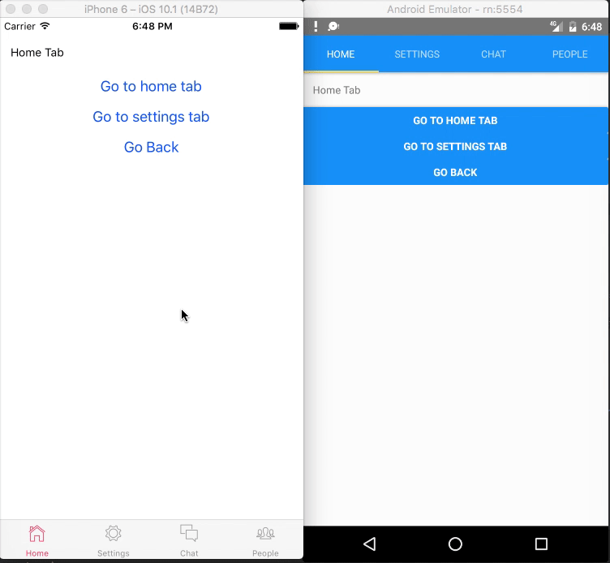

# Getting Started

All templates are based on Giter8 , make sure you setup g8 on your machine - http://www.foundweekends.org/giter8/setup.html (one time process).

Which app you want to build ? 

- [Mobile App](#mobile-app)
- [Web App comping soon](#web-app)
- [Web And Mobile App comping soon](#web-and-mobile-app)


# Mobile App

Make sure you have your environment setup : https://facebook.github.io/react-native/docs/getting-started.html (one time process)


- [App With Stack Navigation](#stack-navigation)
- [App With Tab Navigation](#tab-navigation)
- [App With Drawer Navigation](#drawer-navigation)


#### Stack Navigation


```scala

g8 scalajs-react-universe/mobile.g8

//it will ask for your project name and package, enter them and continue

// if all goes well it will create a new folder with name you specified above

cd project-name//name you specified above

react-native init project-name//make sure you enter same name as above

//it will create new folder with `project-name` , your dir will be like `project-name`/`project-name`.

//copy android and ios folders from inner `project-name` folder to outer `project-name` folder and then delete inner `project-name` folder.

npm install or yarn install

// start server 

npm start

// Start Development

```
[Sbt Tasks](#mobile-development)


#### Tab Navigation




```scala

g8 scalajs-react-universe/mobile.g8 -b tab-navigation

//it will ask for your project name and package, enter them and continue

// if all goes well it will create a new folder with name you specified above

cd project-name//name you specified above

react-native init project-name//make sure you enter same name as above

//it will create new folder with `project-name` , your dir will be like `project-name`/`project-name`.

//copy android and ios folders from inner `project-name` folder to outer `project-name` folder and then delete inner `project-name` folder.

npm install or yarn install

react-native link react-native-vector-icons

// start server

npm start

// Start Development

```
[Sbt Tasks](#mobile-development)


#### Drawer Navigation


```scala

g8 scalajs-react-universe/mobile.g8 -b drawer-navigation

//it will ask for your project name and package, enter them and continue

// if all goes well it will create a new folder with name you specified above

cd project-name//name you specified above

react-native init project-name//make sure you enter same name as above

//it will create new folder with `project-name` , your dir will be like `project-name`/`project-name`.

//copy android and ios folders from inner `project-name` folder to outer `project-name` folder and then delete inner `project-name` folder.

npm install or yarn install

react-native link react-native-vector-icons

// start server

npm start

// Start Development

```
[Sbt Tasks](#mobile-development)


#### Mobile Development

***iOS*** :

```sh
 sbt ~ios:dev // for devlopment
 sbt ios:prod // for production
 // open new terminal
 react-native run-ios
```

***Android*** :

```sh
 sbt ~android:dev // for devlopment
 sbt android:prod // for production
 // start your android emulator / connect ur device
 // open new terminal
 react-native run-android
```

# Web App

Coming soon!....


# Web And Mobile App

coming soon..

